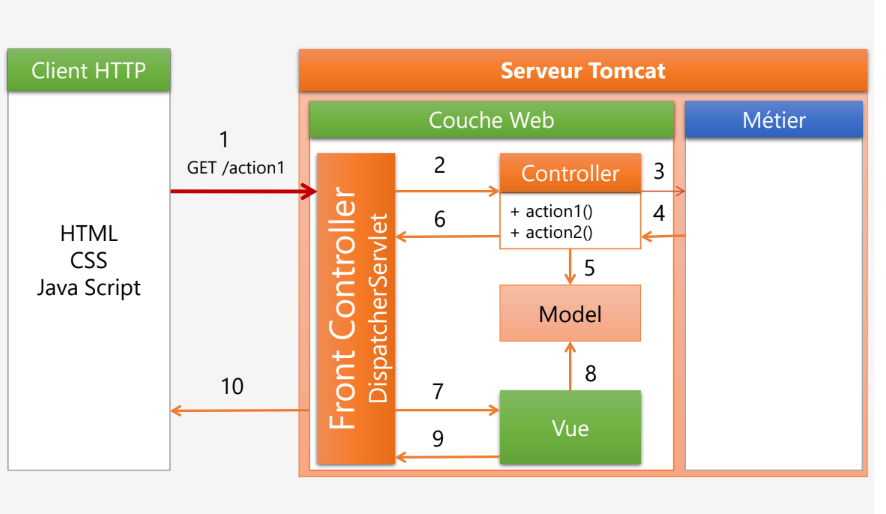
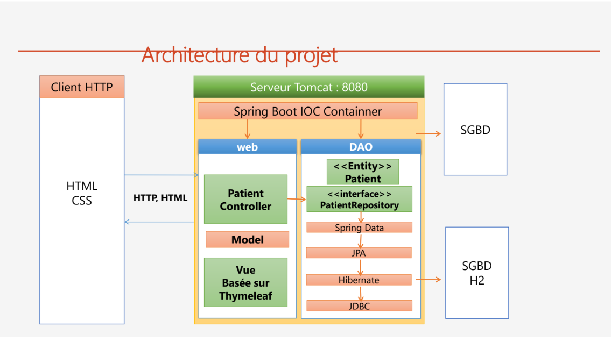
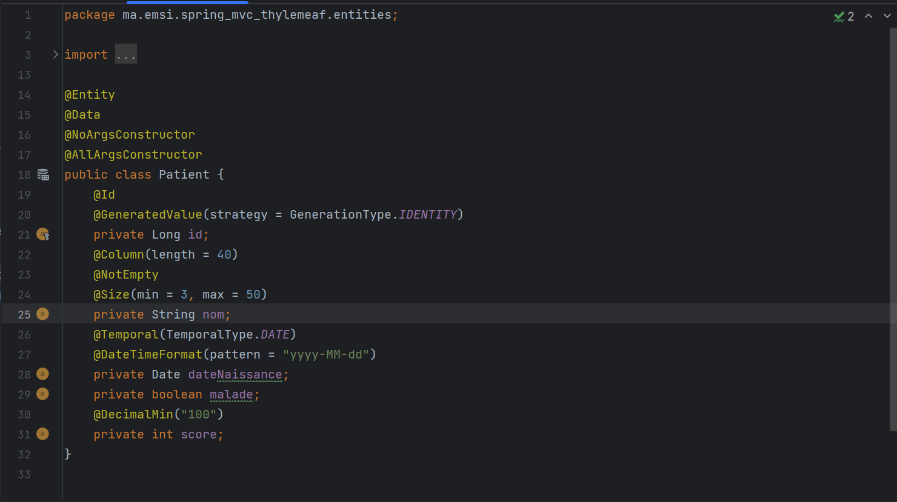
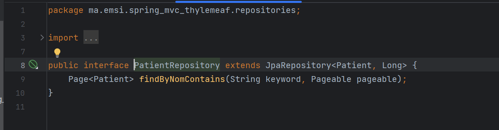
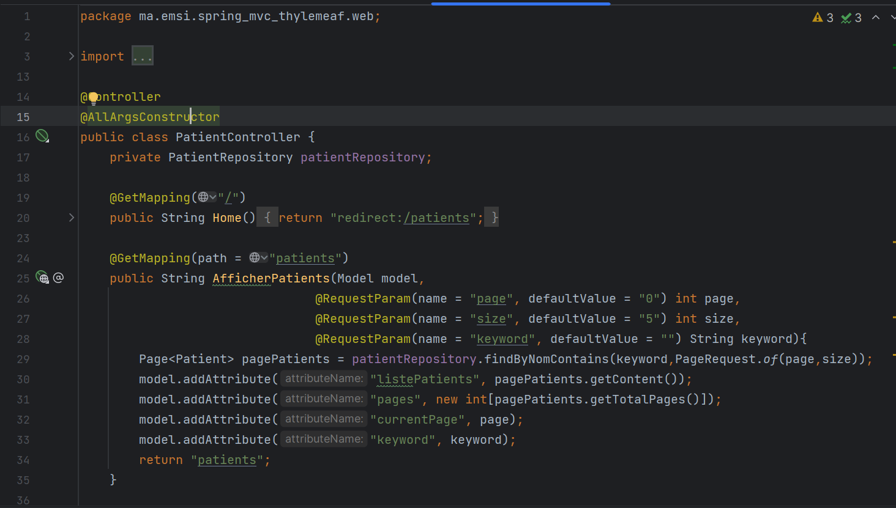
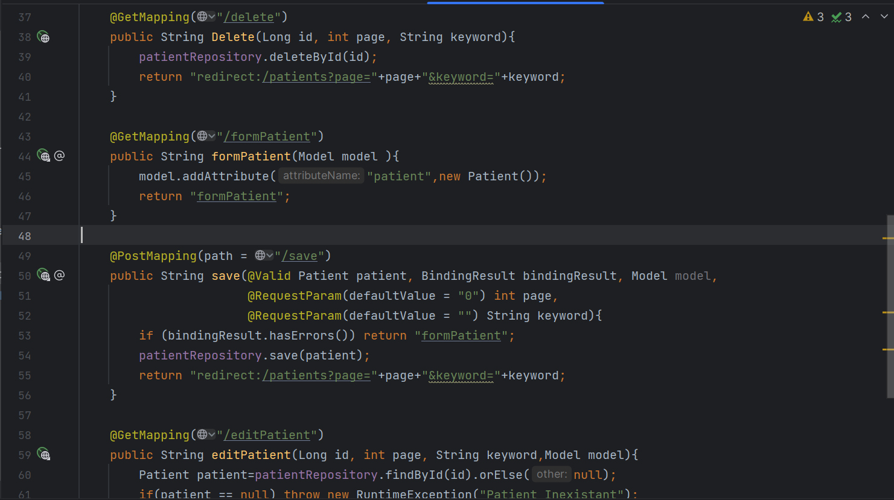
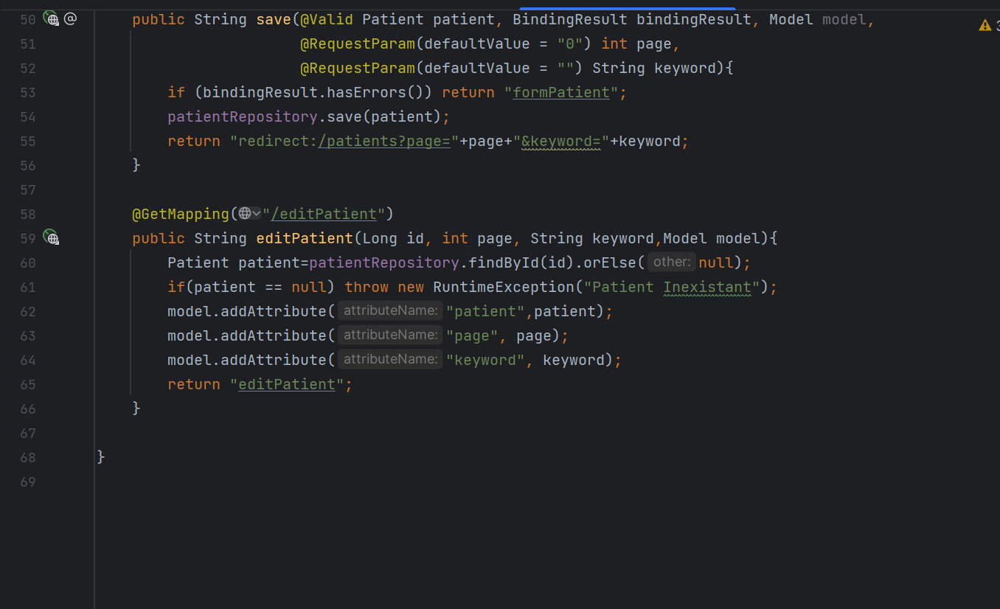
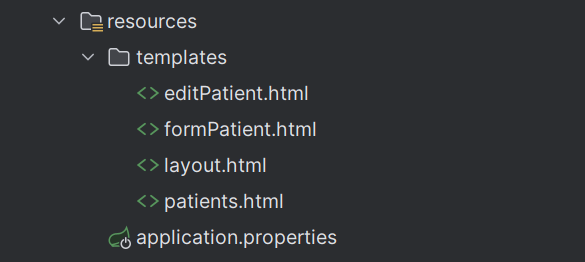

<h2>Servlet, JSP, Spring MVC, Thymeleaf</h2>
<h3>Spring MVC & Thymeleaf :</h3>

Spring MVC and Thymeleaf are two powerful tools for building web applications in Java. Spring MVC provides a robust Model-View-Controller architecture that allows developers to easily separate concerns and build complex web applications with ease. Thymeleaf, on the other hand, is a templating engine that enables developers to create dynamic web pages by integrating HTML templates with data from the server. When used together, Spring MVC and Thymeleaf provide a comprehensive solution 
for building modern web applications that are both flexible and maintainable. In this article, we will take a closer look at these two technologies, exploring their features and benefits, and discussing how they can be used to build powerful web applications in Java..

<h3>Architecture Spring MVC :</h3>

<h3>Architecture du projet :</h3>

<h4>L'Entité JPA Patient :</h4>

<h4>L'interface patientRepository :</h4>

<h4>Le Contrôlleur patientController :</h4>

<h4>L'ensemble des Vues basées sur Thymeleaf :</h4>

